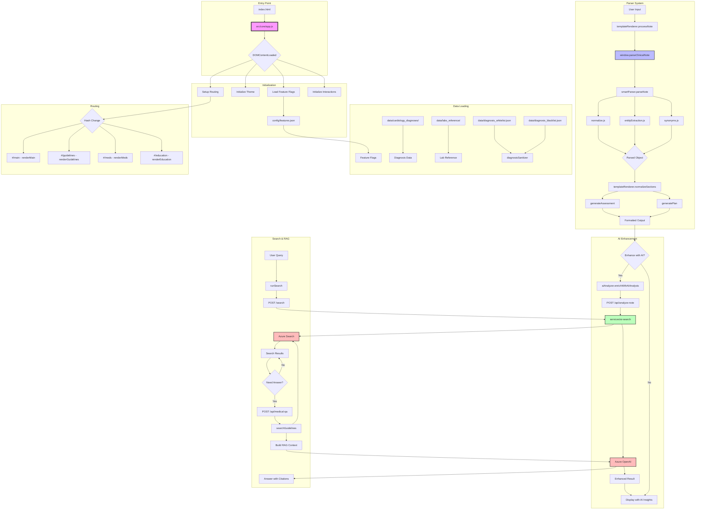
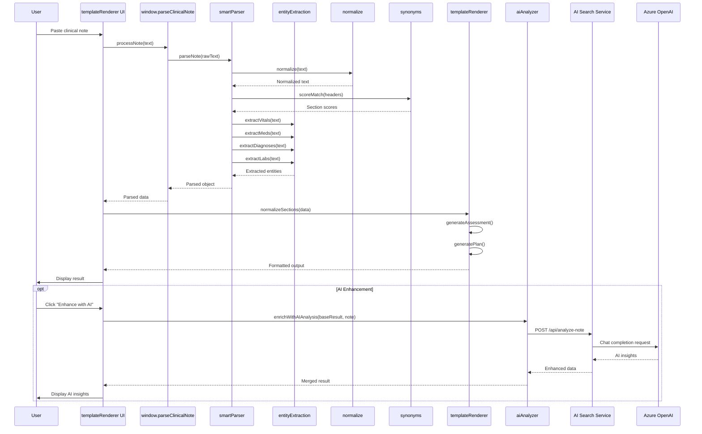
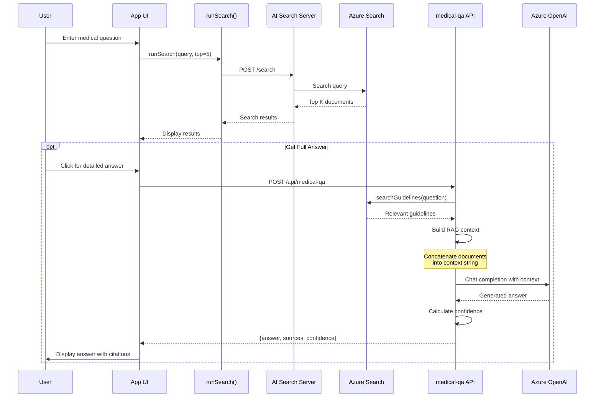
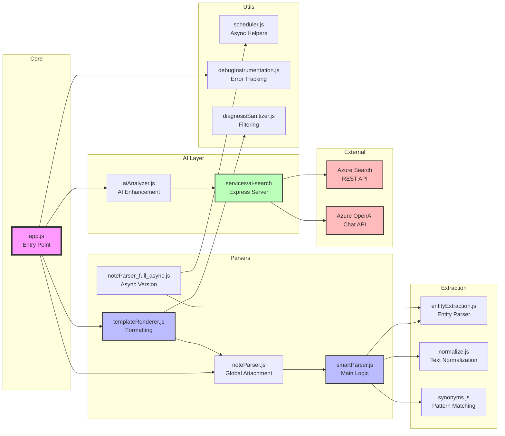
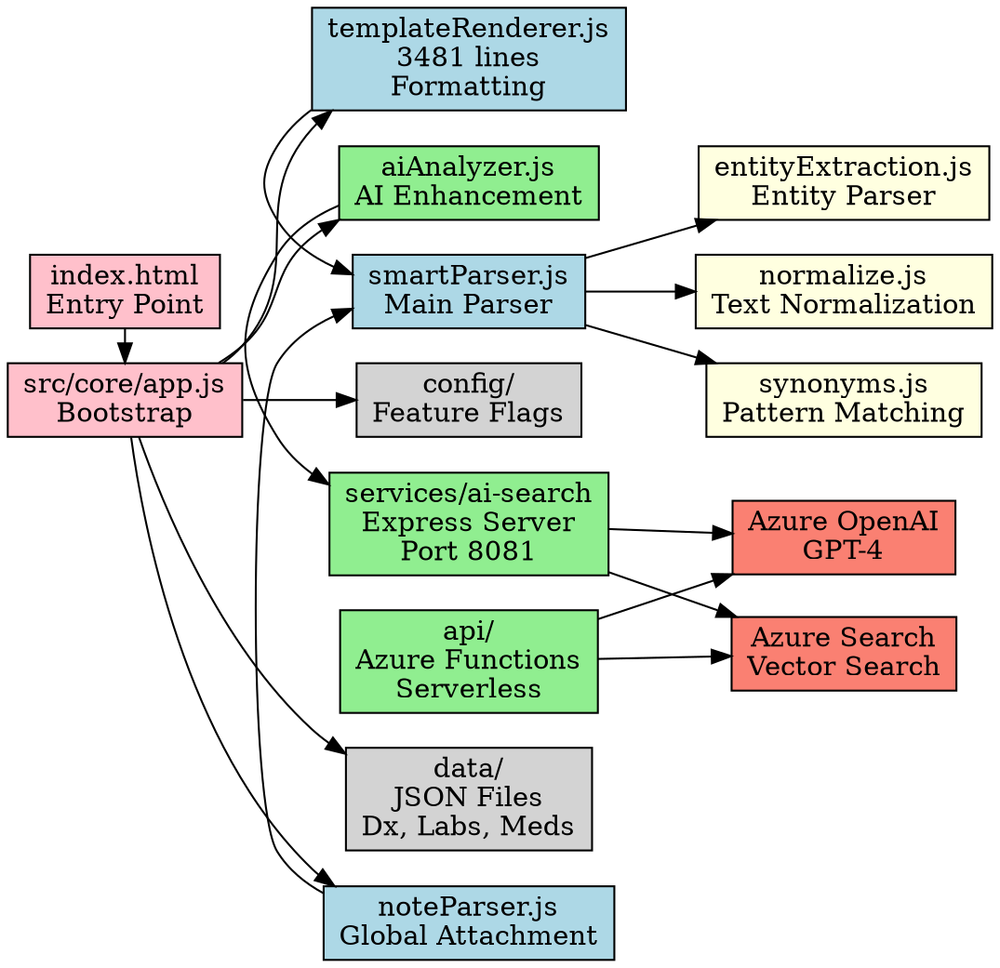

# Cardiology Suite - Visual Architecture Diagrams

## 1. MERMAID FLOWCHART - Complete Application Flow



## 2. MERMAID SEQUENCE DIAGRAM - Clinical Note Parsing Flow



## 3. MERMAID SEQUENCE DIAGRAM - Medical Q&A with RAG



## 4. DEPENDENCY GRAPH - Module Relationships



## 5. COMPONENT INTERACTION DIAGRAM

```mermaid
graph TB
    subgraph "Frontend SPA"
        UI[User Interface<br/>index.html + CSS]
        ROUTER[Hash Router<br/>app.js routing]
        MAIN[Main Page<br/>Note Parsing]
        GUIDE[Guidelines Page<br/>Evidence Browser]
        MED[Meds Page<br/>Drug Reference]
    end
    
    subgraph "Parser Pipeline"
        INPUT[Text Input]
        PARSE[Parser Chain<br/>noteParser → smartParser]
        ENTITY[Entity Extraction<br/>Vitals, Meds, Labs, Dx]
        TEMPLATE[Template Renderer<br/>CIS, Consult, Progress]
        OUTPUT[Formatted Output]
    end
    
    subgraph "AI Services"
        AI_SERVER[AI Search Server<br/>Express :8081]
        ANALYZE[/api/analyze-note<br/>Note Analysis]
        SEARCH[/search<br/>Guideline Search]
        QA[/api/medical-qa<br/>Q&A Endpoint]
        PARA[/api/paraphrase-hpi<br/>HPI Rewriter]
    end
    
    subgraph "Azure Backend"
        FUNC[Azure Functions<br/>Serverless API]
        SEARCH_SVC[Azure Search<br/>Vector Search]
        AI_SVC[Azure OpenAI<br/>GPT-4]
    end
    
    subgraph "Data Sources"
        CONFIG[config/features.json<br/>Feature Flags]
        DX_DATA[data/cardiology_diagnoses/<br/>Diagnosis DB]
        LAB_DATA[data/labs_reference/<br/>Lab Ranges]
    end
    
    UI --> ROUTER
    ROUTER --> MAIN
    ROUTER --> GUIDE
    ROUTER --> MED
    
    MAIN --> INPUT
    INPUT --> PARSE
    PARSE --> ENTITY
    ENTITY --> TEMPLATE
    TEMPLATE --> OUTPUT
    OUTPUT --> UI
    
    MAIN --> ANALYZE
    MAIN --> SEARCH
    GUIDE --> SEARCH
    MAIN --> QA
    MAIN --> PARA
    
    ANALYZE --> AI_SERVER
    SEARCH --> AI_SERVER
    QA --> FUNC
    PARA --> AI_SERVER
    
    AI_SERVER --> SEARCH_SVC
    AI_SERVER --> AI_SVC
    FUNC --> SEARCH_SVC
    FUNC --> AI_SVC
    
    ROUTER --> CONFIG
    MAIN --> DX_DATA
    MAIN --> LAB_DATA
    
    style UI fill:#e1f5fe,stroke:#01579b,stroke-width:2px
    style AI_SERVER fill:#c8e6c9,stroke:#1b5e20,stroke-width:2px
    style FUNC fill:#c8e6c9,stroke:#1b5e20,stroke-width:2px
    style SEARCH_SVC fill:#ffccbc,stroke:#bf360c,stroke-width:2px
    style AI_SVC fill:#ffccbc,stroke:#bf360c,stroke-width:2px
```

## 6. DATA FLOW DIAGRAM - Clinical Note Processing

```
┌─────────────────────────────────────────────────────────────────┐
│                         USER INPUT LAYER                        │
└─────────────────────────────────────────────────────────────────┘
                               │
                               ▼
                    [Clinical Note Text]
                               │
┌─────────────────────────────────────────────────────────────────┐
│                      PREPROCESSING LAYER                        │
│  ┌────────────┐   ┌────────────┐   ┌────────────┐            │
│  │ normalize  │   │  Trim &    │   │   Split    │            │
│  │   Text     │──>│  Sanitize  │──>│   Lines    │            │
│  └────────────┘   └────────────┘   └────────────┘            │
└─────────────────────────────────────────────────────────────────┘
                               │
                               ▼
┌─────────────────────────────────────────────────────────────────┐
│                    SECTION DETECTION LAYER                      │
│  ┌────────────┐   ┌────────────┐   ┌────────────┐            │
│  │  Synonym   │   │   Score    │   │  Assign    │            │
│  │  Matching  │──>│  Headers   │──>│  Sections  │            │
│  └────────────┘   └────────────┘   └────────────┘            │
└─────────────────────────────────────────────────────────────────┘
                               │
                               ▼
┌─────────────────────────────────────────────────────────────────┐
│                   ENTITY EXTRACTION LAYER                       │
│  ┌────────────┐   ┌────────────┐   ┌────────────┐            │
│  │  Extract   │   │  Extract   │   │  Extract   │            │
│  │   Vitals   │   │    Meds    │   │    Labs    │            │
│  └────────────┘   └────────────┘   └────────────┘            │
│  ┌────────────┐   ┌────────────┐   ┌────────────┐            │
│  │  Extract   │   │  Extract   │   │Disambiguate│            │
│  │  Allergies │   │ Diagnoses  │   │  Entities  │            │
│  └────────────┘   └────────────┘   └────────────┘            │
└─────────────────────────────────────────────────────────────────┘
                               │
                               ▼
┌─────────────────────────────────────────────────────────────────┐
│                      PARSED DATA OBJECT                         │
│  {                                                              │
│    sections: { HPI, PMH, PSH, ROS, ASSESSMENT, PLAN },        │
│    vitals: { BP, HR, RR, Temp, SpO2 },                        │
│    meds: [...],                                                │
│    diagnoses: [...],                                            │
│    labs: { ... },                                              │
│    meta: { confidence, warnings }                              │
│  }                                                              │
└─────────────────────────────────────────────────────────────────┘
                               │
                               ▼
┌─────────────────────────────────────────────────────────────────┐
│                    TEMPLATE RENDERING LAYER                     │
│  ┌────────────┐   ┌────────────┐   ┌────────────┐            │
│  │ Normalize  │   │  Generate  │   │  Generate  │            │
│  │  Sections  │──>│ Assessment │──>│    Plan    │            │
│  └────────────┘   └────────────┘   └────────────┘            │
│                            │                                    │
│                            ▼                                    │
│  ┌────────────┐   ┌────────────┐   ┌────────────┐            │
│  │    CIS     │   │  Consult   │   │  Progress  │            │
│  │  Template  │   │  Template  │   │   Note     │            │
│  └────────────┘   └────────────┘   └────────────┘            │
└─────────────────────────────────────────────────────────────────┘
                               │
                               ▼
┌─────────────────────────────────────────────────────────────────┐
│                      FORMATTED OUTPUT TEXT                      │
└─────────────────────────────────────────────────────────────────┘
                               │
                               ▼ (Optional AI Enhancement)
┌─────────────────────────────────────────────────────────────────┐
│                       AI ENHANCEMENT LAYER                      │
│  ┌────────────┐   ┌────────────┐   ┌────────────┐            │
│  │   Azure    │   │  Extract   │   │   Merge    │            │
│  │  OpenAI    │──>│  Insights  │──>│   Results  │            │
│  └────────────┘   └────────────┘   └────────────┘            │
└─────────────────────────────────────────────────────────────────┘
                               │
                               ▼
                     [Enhanced Output to User]
```

## 7. GRAPHVIZ DOT FORMAT - Full System Architecture



## 8. ASCII ART - High-Level Architecture

```
┌─────────────────────────────────────────────────────────────────────┐
│                         CARDIOLOGY SUITE                            │
│                     Privacy-First Clinical Tool                     │
└─────────────────────────────────────────────────────────────────────┘
                                  │
                                  │
      ┌───────────────────────────┼───────────────────────────┐
      │                           │                           │
      ▼                           ▼                           ▼
┌──────────┐              ┌──────────────┐           ┌─────────────┐
│  User    │              │   Frontend   │           │   Backend   │
│Interface │◄────────────►│   Parser     │◄─────────►│  Services   │
│  (HTML)  │              │   Engine     │           │  (Express)  │
└──────────┘              └──────────────┘           └─────────────┘
      │                           │                           │
      │                           │                           │
      ▼                           ▼                           ▼
┌──────────┐              ┌──────────────┐           ┌─────────────┐
│  Hash    │              │   Template   │           │   Azure     │
│ Routing  │              │   Renderer   │           │  Functions  │
└──────────┘              └──────────────┘           └─────────────┘
      │                           │                           │
      │                           │                           │
      ▼                           ▼                           ▼
┌──────────┐              ┌──────────────┐           ┌─────────────┐
│ Feature  │              │  Entity      │           │   Azure     │
│  Pages   │              │ Extraction   │           │   Search    │
└──────────┘              └──────────────┘           └─────────────┘
                                  │                           │
                                  │                           │
                                  ▼                           ▼
                          ┌──────────────┐           ┌─────────────┐
                          │      AI      │           │   Azure     │
                          │  Enhancement │◄─────────►│   OpenAI    │
                          │   (Optional) │           │   (GPT-4)   │
                          └──────────────┘           └─────────────┘
```

---

*End of visual diagrams document*
